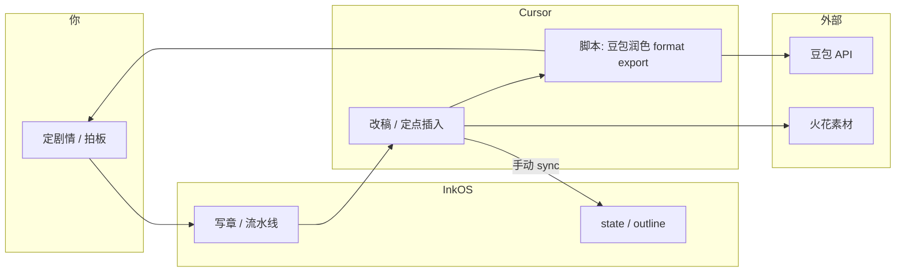

# 最近操作流程观察

> **更新**：2026-07-03  
> **状态**：观察期进行中（目标：积累 3–5 次完整循环后再「可以总结了」）  
> **关联**：[session-log/2026-07-03.md](../session-log/2026-07-03.md) · [project-adjustment-backlog.md](../synthesis/project-adjustment-backlog.md)

---

## 用户最初要记的（元目标）

| 阶段 | 做什么 | 产出 |
|------|--------|------|
| 1. 观察 | 照常 InkOS 写 + Cursor 改，**不改习惯** | 本文件 + session-log |
| 2. 记录 | Agent 记步骤、切换、等待、手动胶水 | recent-operations 每条「操作链」 |
| 3. 总结 | 几天后说「可以总结了」 | `synthesis/workflow-patterns.md` |
| 4. 定方案 | 一起讨论 | Cursor Rule / PRODUCTION.md / InkOS 改什么 |

**并行**：A/B InkOS 写 vs Cursor 写 → `ab-test/log.md` → `synthesis/ab-conclusion.md`

---

## 当前协作全景（口述 + 今日实测）



### 三个核心摩擦（用户多次口述，今日又验证）

1. **人在中间当胶水**：InkOS ↔ Cursor 切换；改完正文还要手动让 InkOS 更新 state  
2. **改稿上下文**：InkOS 改稿规则太多、太贵、改不动；Cursor + 豆包 **短语+正文** 更灵  
3. **盯进度**：终端跑脚本、等 API、看报错——用户不想反复问「完成了吗」

### 用户偏好（观察期已确认）

| 维度 | 偏好 |
|------|------|
| 写章 | 需要 state / 大纲 / 角色，防下一章跑偏 |
| 改稿 | **大改只发正文**，少带全书规则 |
| 调度 | Agent **自主判断**松紧（润色 vs 重写 vs 定点插） |
| 参与 | 少切换、少盯终端；致命错才打断 |
| 记录 | 自然反馈即记（「这章不错」= 场景+prompt 进 retained） |

---

## 操作链记录（按时间倒序）

每条格式：**触发 → 步骤 → 工具 → 你手动做了什么 → 摩擦 → 可沉淀**

---

### 2026-07-03 · 快穿-软妹炮灰 · InkOS 写章链（完整 #3，首次实测）

**触发**：用户「用 inkos 写接下来三章，走完整流程」  
**类型**：InkOS `write next --count 3`（plan → compose → draft → audit → state 结算）  
**主稿**：`books/快穿-软妹炮灰把疯批男主钓疯了/chapters/0006–0008.md`  
**状态**：✅ 三章完成，待用户审阅（ready-for-review ×3）

| 步 | 操作 | 工具 | 用户参与 |
|----|------|------|----------|
| 0 | 启动 Studio | `inkos studio` :4567 | 用户自行操作 |
| 1 | Agent 查 status / doctor | `inkos status` `inkos doctor` | 确认 5 章基线、API OK |
| 2 | 连写 3 章完整管线 | `inkos write next --count 3` | **零手动胶水**，等 ~25min |
| 3 | Ch6 落盘 | 豆包 seed-2.0-pro | 2298字，审计通过 |
| 4 | Ch7 落盘 | 同上 | 2902字，审计通过 |
| 5 | Ch8 落盘 | 同上 | 2354字，审计通过 |
| 6 | state 自动 sync | InkOS 内置 | ✅ 当前章 8，好感 80/100 |

**产出摘要**
- Ch6：撒娇喂糖刷满好感！记忆碎片惊现同款脸？（75 好感，解锁记忆碎片）
- Ch7：混混当众指认主使！疯批放话谁敢动她？（校门口围堵打脸）
- Ch8：开学典礼被泼脏水？躺赢打脸拿满好感度！（主线任务完成，1800 积分，新任务：家传翡翠坠）

**本链摩擦**
- 用户需等 ~25 分钟，不能问「完成了吗」——Agent 后台监控即可
- Ch6/7 字数偏短（~2300–2900 vs 前章 ~4700）
- planner memo parse 失败重试（Ch7/8「日常/过渡」空段）
- 状态校验 hook 标记偶发不准（resolved 过早 / remark 未更新）
- 审计 warning：标题「傅总」重复、跨章短语重复、「了」字连句

**与短篇链差异**
- ✅ state 自动 sync，无需手动胶水（本次最大差异）
- 改稿尚未进入 Cursor 阶段

**InkOS state**：已同步（8 章，Pending review 3）  
**待办**：用户通读 Ch6–8 → Cursor 改稿（若需要）→ 下一批写章或 approve

---

### 2026-07-03 · 快穿软妹炮灰 · Ch9–11 全流程（Agent 自动跑完）

**触发**：用户「按流程写接下来三章，做到结束，中途自行判断」  
**类型**：标准链 #2 = InkOS 写 → Agent 审读 → 结构轻改 → 豆包润 → 排版 → sync

| 步 | 操作 | 结果 |
|----|------|------|
| 1 | `inkos write next --count 3` | ~25min，Ch9–11 ready-for-review |
| 2 | Agent 审读 Ch8–11 | P1 剧情线 OK（顾明山→绑架→搬家→眼线）；无 Ch6 式双写 |
| 3 | 结构轻改 | Ch10 标题 dedup 误改「苏晚」→ 手修；P0 好感/100 说明+躺赢积分链；删 Ch11 重复 S004 奖励；P2 换「好戏开场」「有我在」 |
| 4 | 豆包润 Ch9–11 | `polish_doubao.mjs 9-11` ~7min |
| 5 | format + fix_punctuation | 9–11 排版对齐 Ch1–8 |
| 6 | `inkos write sync 11` + 手改积分 2500 | state 同步 |

**审计摩擦**：Ch10 标题被 InkOS title-dedup 改成「苏晚」；hook 标记仍偶发不准；Ch9–11 字数 ~3200–3700（润色后）

**当前节点**：好感 92/100 · 躺赢积分 **2500** · T08 翡翠坠 60% · 林薇薇提前 3 天出狱预警

**待用户**：通读 Ch9–11 满意度 → 继续 Ch12+ 或 approve

---

### 2026-07-03 · 快穿软妹炮灰 · Ch6–8 全流程改稿（用户要求记录）

**触发**：InkOS 连写 Ch6–8 后，**用户通读新章**发现重复；逐步扩大到 Ch1 全书审读，再进入 P0→P1→P2→润色→排版  
**类型**：长篇观察 #3 完整链 = 切长篇 → InkOS 写章 → **用户读稿发现问题** → Cursor 结构改 → 火山 API 润色 → 排版对齐 → state 手改

#### 阶段 0 · 前提（Ch1–5 已存在，非本次新建）

| 项 | 状态 |
|----|------|
| 书目 | `books/快穿-软妹炮灰把疯批男主钓疯了/` 已有 Ch1–5（导入/InkOS 早期稿） |
| 基线 | 5 章 / ~23691 字前段；Ch5 末好感 73/80，暗卫+混混+典礼线已铺垫 |
| 用户意图 | 结束网恋AI 短篇链，切长篇；要求 **全程记录操作** |

#### 阶段 1 · 开写（19:50–20:21）

| 步 | 时间 | 操作 | 工具 | 用户参与 |
|----|------|------|------|----------|
| 0 | 19:50 | 声明「我要写长篇了，记得记录操作」 | Cursor | 开启观察 #3 |
| 1 | 19:53 | 启动 InkOS | `inkos studio` → :4567 | 用户自行开 Studio |
| 2 | 19:55 | 指定书名 + 连写三章 | Agent 查 `status`/`doctor`（5 章基线 OK） | 口头指定书名 |
| 3 | 19:55–20:21 | 完整写章管线 | `inkos write next --count 3` | **等 ~25min**；20:26 发「继续」催进度 |
| 4 | 20:21 | Agent 汇报产出 + **审计提示** | 读 Ch6–8 开头 + state | 用户尚未改稿 |

**Agent 已提示、用户尚未验证的 warning**：字数偏短、跨章短语重复、标题「傅总」重复、hook 标记不准。

#### 阶段 2 · 发现问题（20:30–20:37）← **改稿链的真正起点**

| 步 | 时间 | 用户怎么发现的 | Agent 验证 | 结论 |
|----|------|----------------|------------|------|
| 5 | 20:30 | 通读 Ch6–8：**「有些片段我前面看过啊」** | 对比 Ch5–8 全文 + grep 台词/描写 | Ch6↔Ch7 校门口打脸写两遍；Ch7↔Ch8 典礼时间线矛盾 |
| 6 | 20:31 | 要求 **从 Ch1 通读**：**「奖励我感觉都看过好几次」** | 通读 Ch1–8 + grep 系统弹窗/内心戏/桥段 | P0 奖励预告 5 遍；Ch1–2 推人证据重复；Ch2 起每章林薇薇打脸循环 |
| 7 | 20:32 | 拍板 **「p0」** | Cursor 改 Ch2–8 系统弹窗 | ⚠️ Agent 误删内心独白 |
| 8 | 20:34–36 | **「恢复所有内心独白」「不是每章重复别删，3–5 章重复一次可以」** | 全文恢复 + 明确 dedup 规则 | **用户偏好定型**：只 dedup 每章都重复的句；系统弹窗 dedup 与内心戏分离 |
| 9 | 20:37 | 拍板 **P1** 证据与打脸合并 | Ch2 删重复证据；Ch6 侧门、Ch7 后台、Ch8 唯一典礼打脸 | — |
| 10 | 20:46–49 | **「段落都没换行」** → **「人物描写全是重复的」** → 选 **B** 方案 | P2 描写轮换 Ch2–8 | Ch1 母版保留 |

**发现问题的路径（可复用）**：InkOS 写完 → Agent 给审计摘要 → **用户通读新章体感重复** → 要求从 Ch1 扩面审读 → 分级 P0/P1/P2 拍板。

#### 阶段 3 · 改稿 + 润色 + 对齐（20:57–23:22）

| 步 | 操作 | 工具/模型 | 用户参与 |
|----|------|-----------|----------|
| 11 | **GLM-5.2 润色 Ch5–8** | `polish_glm52.py` · `glm-5-2-260617` | 标题+正文+简单提示，依次跑 |
| 12 | **豆包润色 Ch6–8** | `polish_doubao.mjs` · `doubao-seed-2-1-pro-260628` | **只发正文+「改为番茄女频风格」**，依次跑 |
| 13 | 排版不对（对比 Ch1–5） | `format_like_early.py` | 一句一拍+段间空行 |
| 14 | 系统/好感模板不对 | Cursor 手改 Ch6–8 | /80、【叮！】躺赢积分 |
| 15 | 破折号/标点/换行 | `fix_punctuation.py` + 手改 | 用户要求审阅 |
| 16 | state 同步 | 手改 state + `inkos write sync 8` | 积分链 → 1800 |
| 17 | 记录操作 | 本书卡 + observations + session-log | 本条 |

**用户偏好（本书）**
- 豆包：**无 system**，只「正文 + 改为番茄女频风格」  
- 内心戏：**不批量删**；系统大奖全文弹一次即可  
- 排版：跟 Ch1–5；润色后**必跑**排版+标点脚本  
- 好感/积分：正文 **80/80** + **躺赢积分**

**摩擦**
- InkOS 审计有 warning，但**用户是在通读后才确认**问题，不是 audit 自动拦截
- P0 首轮 Agent 把「弹窗 dedup」和「内心戏 dedup」混做 → 用户纠正
- GLM/豆包输出整段粘连，丢失网文空行  
- 自动格式化在逗号处过度断行 → 需二次合并  
- `write sync` 仅最新章；Ch6–7 摘要、hooks 需手改  
- InkOS 生成仍易重复校门口/典礼桥段，**写后必用户通读 + Cursor 结构 pass**

**沉淀**：`books/快穿-软妹炮灰把疯批男主钓疯了.md` · `books/…/polish/*` · 本段  
**InkOS state**：已 sync Ch8 + 手改 summaries（80/80 · 1800 躺赢积分）

**待办**
- [ ] 通读 Ch6–8 定稿满意度  
- [ ] `inkos write next` 写 Ch9+  
- [ ] 可选：Ch1–4 好感 /100 与 /80 统一

---

### 2026-07-03 · 【进行中】长篇 · 操作观察 #3（待书名）

### 2026-07-03 · 工厂文 · 定稿→扩写→润色→上架（完整循环 #1）

**触发**：已有 `temp-revised-story-final.md` 母版，要上番茄  
**类型**：短篇定稿后扩写上架（非 InkOS 写章流）

| 步 | 操作 | 工具 | 用户参与 |
|----|------|------|----------|
| 0 | 确认母版、读者最爽终局方向 | Cursor 对话 | 拍板逆袭落袋、专利署名 |
| 1 | 四模型对比重写选底稿 | 火山 API 脚本 `model-compare/` | 选 Turbo/GLM 路线 |
| 2 | v3 精改定稿 | Cursor 手工改 `temp-revised-story-v3.md` → final | 「你帮我改吧」 |
| 3 | 火花查桥段 → 单点插入 | huohua + `tasks.json` | 早期试过 `run-step.mjs` |
| 4 | 手工补钩 E01–E12 | Cursor 定点插入 | 对照 web 炸裂稿 |
| 5 | 豆包 10 章节拍审读 | `run-doubao-tomato-structure.mjs` | 可选，已跑 |
| 6 | 按章补字 | Cursor 手工 | 禁整章 API |
| 7 | 豆包润色 2章/批 ×5 | `run-doubao-polish-chapters.mjs` | 盯终端等 API；认可短语+正文 |
| 8 | format 2章/批 ×5 | 同上 + `format` 参数 | 发现章首【】问题 |
| 9 | 合并上架包 | `export-pack.mjs` | — |
| 10 | 删章首【】、保留开篇钩子 | Cursor 手工 | 「千万别改剧情」 |
| 11 | 封面 | `run-cover.mjs` + `fix-cover-fanqie.mjs` | 比例屡次错，必验像素 |
| 12 | 发布 + 记入 KB | txt + writing-kb | 要求记入最初方案 |

**本链摩擦（重复性）**

- 整章 API 毁文风 → **改稿应定点，不应流水线整章丢模型**
- 扩写基线混用 → **母版路径要单一真源**
- format 副作用 → **后处理清单要固化**
- 封面比例 → **后处理脚本必跑，不信模型**
- 脚本多、要记命令 → **适合收进 PRODUCTION 或一键脚本**

**本链尚未覆盖**

- ❌ InkOS 写章（本书是 notes 母版流，非 `shorts/` pipeline）
- ❌ 改完回写 InkOS state
- ❌ A/B 写初稿

**沉淀**：[factory-story-workflow.md](../synthesis/factory-story-workflow.md)（本书 SOP 样本）

---

### 2026-07-03 · KB 搭建 + 素材整理（元操作 #0）

**触发**：讨论流程痛点，定观察方案  
**类型**：流程设计，非写书

| 步 | 操作 | 产出 |
|----|------|------|
| 1 | 用户口述 InkOS→Cursor 痛点 | 对话结论 |
| 2 | 用户选 D：A/B + 可维护 KB | `writing-kb/` 全套 |
| 3 | Cursor Rule 推断记录 | `writing-knowledge-base.mdc` |
| 4 | 火花/题材验证接入 KB | `materials/` `research/` |
| 5 | 整理汉子茶摘抄 | `ref-小团体里的汉子茶.md` |

**摩擦**：跨对话不自动记住 → **必须靠 KB 文件持久化**（用户原顾虑）

---

### 2026-07-03 · 网恋AI弹窗断线 · Cursor 改稿链（完整 #2）

**触发**：GLM-5.2 扩写稿 glm52.md 需人工修订；用户连续多轮改逻辑/爽点/人物/结构  
**类型**：Cursor 定点改稿（非 InkOS 写章；非 API 批量润色）  
**主稿**：`shorts/网恋AI弹窗断线/drafts/v004/56块装AI断线，我砸千万扒出堂姐毒计-glm52.md`

| 步 | 操作 | 工具 | 用户参与 |
|----|------|------|----------|
| 0 | 底稿 glm52（GLM 扩写 doubao-pro，~1.3 万字） | GLM-5.2 API | 一句指令扩写 |
| 1 | 反派提智一档 | Cursor 手工改 glm52 | 「反派要会包装会还手」 |
| 2 | 逻辑审阅 + 爽点密度 | Cursor 手工改 | 「审逻辑、加爽点」 |
| 3 | 修私房菜人设矛盾 | Cursor 手工改 Ch1 | 用户指出「舍不得点」不对 |
| 4 | 各角色动机补全 | Cursor 手工 + KB 人物表 | 「角色缺出发点显得很空」 |
| 5 | **倒叙结构大改** | Cursor 重组 Ch1–4 | Ch1 AI断线爆点 → Ch2–3 闪回 → Ch4 现线 |
| 6 | 妈妈立体化 | Cursor 闪回+医院+电话三场 | 跪门槛/吉日表/第一次站女儿 |
| 7 | 新对话起手式沉淀 | `INDEX.md` 已有；补 `books/网恋AI弹窗断线.md` 复制块 | 用户贴模板确认 |
| 8 | 过程总结 | 对话内总结 | 用户要「先总结再接着改」 |

**本链摩擦**

- 长对话 **上下文被 summarize**，新对话需 `@books/xxx.md` + `@glm52.md` 续上（用户已确认起手式）
- 改稿轮次多、**未实时写 observations**（本条为补记）
- InkOS state **未同步**（全书在 Cursor 改，未走 InkOS 管线）
- outline v001 **仍为顺叙**，与 glm52 倒叙不一致 → 待同步

**沉淀**

- `books/网恋AI弹窗断线.md`：动机表、叙事结构、四轮修订记录、接着改复制块
- 改稿原则：反派包装、妈妈可怜可气 vs 堂姐清醒坏、数字爽点

**InkOS state**：未同步 / 不适用  
**待办**：~~压短 Ch2 闪回 · 通读去重 · 导出平台 txt~~ · outline 同步 · **P1 平台稿**

---

### 2026-07-03 · 网恋AI弹窗断线 · 平台稿 P0 修补

**触发**：逻辑审阅列出 P0；用户「先改 P0」  
**类型**：脚本回填 + 手工补 07 对峙  
**主稿**：`drafts/v004/56块装AI断线，我砸千万扒出堂姐毒计-作家平台.txt`

| 项 | 处理 |
|----|------|
| 01 重复弹窗 + 第三人称 | glm52 回填 01–02，钩子保留一次 |
| 苏晚 / 22岁 | 全局清零，统一苏砚 25 岁 |
| 父病车祸 ICU | 改回双癌住院 + 催债「从医院抬出来」 |
| 07 肠胃炎 / 语音重复 | 改回陪床野草莓，删语音条重复段 |

**脚本**：`fix-p0-platform.mjs`（可重复跑）  
**同步**：`56块装AI断线…-glm52-平台.md`  
**字数**：约 14917 字  
**残留（P1）**：~~03口播感 · 03尾二次断线 · 迈凯伦/迈巴赫 · 卖肾 · 小李称呼~~ → 见下方 P1 记录

---

### 2026-07-03 · 网恋AI弹窗断线 · 平台稿 P1 修补

**触发**：用户「p1」  
**主稿**：`drafts/v004/56块装AI断线，我砸千万扒出堂姐毒计-作家平台.txt`

| 项 | 处理 |
|----|------|
| 03 口播感 | 删「谁懂啊家人们」，改 glm52 式开篇 |
| 03 尾二次断线 | 改桥接句「就是你们知道的下一个画面」，不重复弹窗 |
| 迈凯伦/迈巴赫 | 统一骚粉迈凯伦（07/09） |
| 卖肾台词 | 改回「为我好？这是凭证」+ 删卖肾 |
| 小李设定 | 06 统一称小李；当面质问「建议婚前加名」再泼水 |

**字数**：约 14930 字  
**待办（P2）**：~~经侦立案半句 · 闪回时间锚点 · outline 同步倒叙~~ → 见下方 P2 记录

---

### 2026-07-03 · 网恋AI弹窗断线 · 平台稿 P2 修补

**触发**：用户「p2」  
**主稿**：`drafts/v004/56块装AI断线，我砸千万扒出堂姐毒计-作家平台.txt`

| 项 | 处理 |
|----|------|
| 经侦立案 | 06 仅威胁；08 末递材料；09 补「受理回执刚到」；10 医院改协查函晚十分钟 |
| 闪回时间锚 | 01 凌晨1:17 · 02 腊月廿八 · 03 一百八十天 · 04 断线这夜 · 06–10 次日/下午/夜 |
| 动线 | 05 删「先堵林逾」矛盾，统一先掀桌再城东 |
| 妈闪回 | 03 补梳妆镜吉日表（对齐 glm52） |
| outline | `outline/v001.md` 增倒叙章表 |

---

### （待观察）网恋AI弹窗断线 · InkOS 写章流

**预期链**（用户口述的标准路径，**尚未在本对话实测**）：

```
InkOS 写 v004 第 N 章 → 等终端完成 → Cursor 改稿（只正文）
→ 满意 → 手动让 InkOS 更新 state → 下一章
```

**待记字段**：每章写耗时、改耗时、state 是否 sync、InkOS 报错、改稿轮数

**状态**：v004 主稿 **glm52.md** 在 Cursor 多轮改稿中（2026-07-03 下午）；InkOS 写章链仍待实测

---

## 2026-07-03 · 刑辩律师我不装了 · 已发布

**用户**：改完并上传小说平台；封面脸大小偏好已记 retained。

**下一本**：网恋AI弹窗断线

---

## 重复步骤初筛（观察不足 3 次，暂为假设）

| 重复出现 | 出现场景 | 暂定归属 |
|----------|----------|----------|
| 定母版 / 唯一真源 | 工厂文 | 目录约定 + Rule |
| 短语+正文调豆包，2章/批 | 工厂文润色 | 脚本 + retained prompt |
| 定点插入，禁整章 API | 扩写、补钩 | Rule + 避免清单 |
| 上架后处理清单 | format/export/封面/删【】 | checklist 模板 |
| InkOS 写完 → Cursor 改 → 手动 sync | 口述标准流 | **待观察验证** |
| 盯终端等脚本 | 豆包批量 | PRODUCTION.md 或 Automation |

---

## 下一步观察建议

1. **补一条 InkOS 写章链**：网恋AI 写 11 章 或 重改 1 章，记完整切换  
2. **A/B 相邻两章**：一章 InkOS 写、一章 Cursor 写，同改稿方式  
3. **累计 3–5 条操作链** 后：用户说「可以总结了」→ `workflow-patterns.md`  
4. 讨论时对照 [project-adjustment-backlog.md](../synthesis/project-adjustment-backlog.md)

---

### 2026-07-03 · 网恋AI · doubao21 验收修 P0+P2

| 步 | 操作 | 工具 | 用户参与 |
|----|------|------|----------|
| 1 | 通读 `作家平台-doubao21.txt`：苏晚/人称/剧情锚 | grep + 对照母版 | 拍板验收 |
| 2 | P0：07章「下午1点15分」→「凌晨1点15分」 | 手改 ch07 | — |
| 3 | P2：Ch03「跟跟我」→「跟我」；Ch08「五十六块」→「56块」×3 | 手改 ch03/ch08 | — |
| 4 | merge + export | merge/export 脚本 | — |

**摩擦**：07章豆包改写误把凌晨写成下午，需人工 grep 时间锚  
**沉淀**：`作家平台-doubao21.txt` 可上平台  
**InkOS state**：不适用

---

### 2026-07-03 · 网恋AI · 全流程实验总结（用户要求记实验）

**类型**：Cursor 改剧情 → 平台稿 P0–P2 → 豆包2.1逐章 → 验收 → 书名 → 逻辑删改 → 待上架

| 阶段 | 操作 | 工具/模型 | 结论 |
|------|------|-----------|------|
| 1 剧情母版 | 反派提智、倒叙、妈妈动机、爽点 | Cursor 手改 glm52 | 定稿结构 Ch1 断线→Ch2–3 闪回→Ch4 现线 |
| 2 平台逻辑 | P0 人称/苏砚/双癌；P1 口播/迈凯伦/小李；P2 经侦链 | Cursor + fix-p0 | `作家平台.txt` |
| 3 文风 | 炮灰钓疯批映射 + Ch01–10 手改短句 | 映射卡 + Cursor | 苏砚硬钓不软妹 |
| 4 语感批量 | **豆包 2.1 Pro 逐章** | `run-doubao-platform-chapters.mjs` | 短语+正文；Ch1 含钩子 |
| 5 验收 | grep 苏晚/第三人称/剧情锚 | 对照母版 | 07章下午→凌晨；56块统一 |
| 6 定稿 | 书名「网恋以为是AI，结果他花56块把我删了」 | 用户拍板 | export 脚本已改书名 |
| 7 逻辑删 | Ch04 爸的烟/爸骂人 | **只删不改写**（用户明确偏好） | 约 16335 字 |

**用户实验偏好（须记住）**  
- 豆包 API：**只发短语+正文**，无 system/润色师；Ch1 钩子同批，其余逐章  
- 逻辑不对：**直接删**，不要改写（改更容易出错）  
- 女频：**不宜**写中华烟、不宜爸跑路后还抽爸的烟/爸骂人  
- 封面：可自由发挥，不必套工厂文 600×800 模板  

**摩擦**  
- 豆包逐章会误改时间（下午/凌晨）、偶发错字（跟跟我）  
- 用户自改压缩版 vs doubao21 扩写版是两套密度，上平台用 doubao21  

**沉淀**：`books/网恋AI弹窗断线.md` · `prompts/retained.md` · 本段  

---

## 追加模板（Agent 复制用）

```markdown
### YYYY-MM-DD · [书名] · [触发简述]

**类型**：InkOS写章 / 定稿上架 / 局部改稿 / …

| 步 | 操作 | 工具 | 用户参与 |
|----|------|------|----------|
| 1 | | | |

**摩擦**：
**沉淀**：（retained / phrases / books / synthesis）
**InkOS state**：已同步 / 未同步 / 不适用
```
